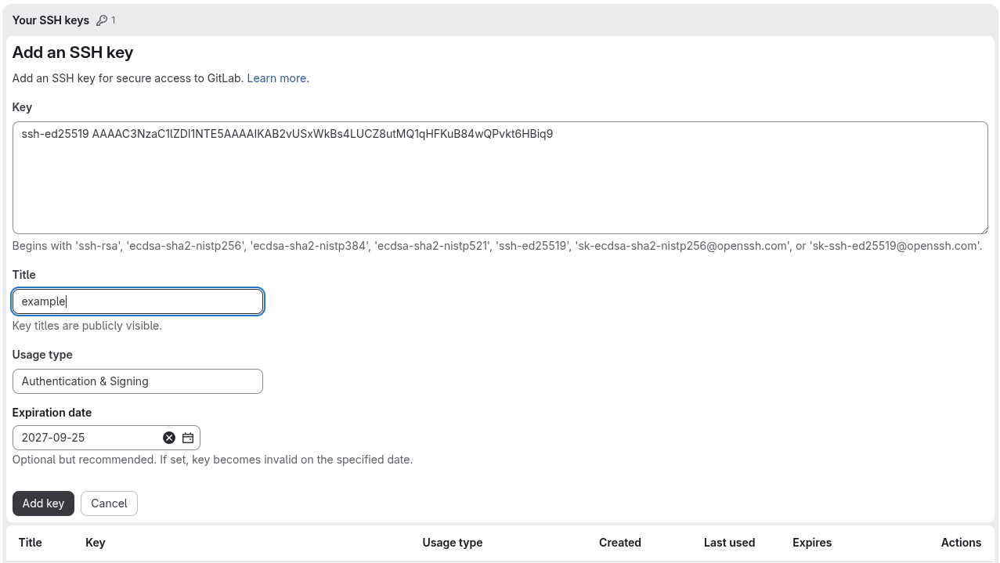
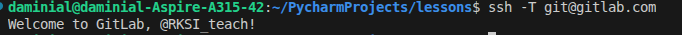
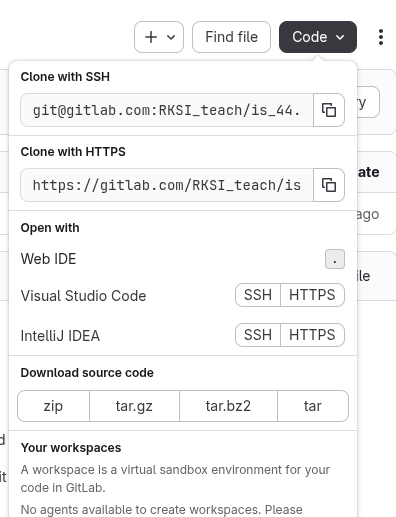
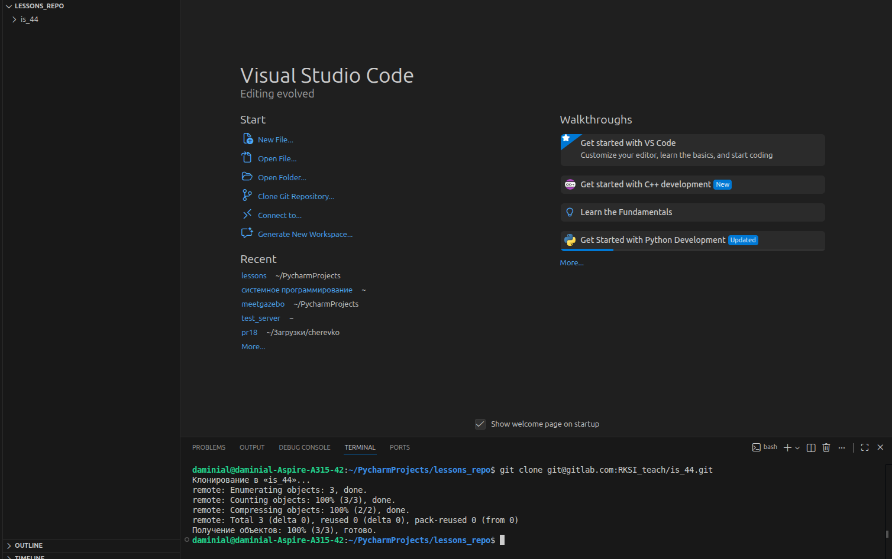
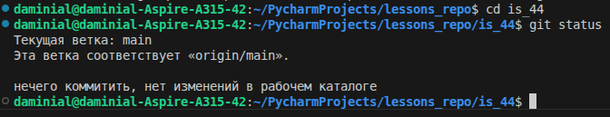

# Практическое занятие №5. Создание своей ветки и первого коммита

**Цель работы:** зарегистрироваться на GitLab, подключиться, создать свою ветку и запушить в репозиторий группы.

---

## Задание

Зарегистрируйтесь на сайте GitLab, отправьте старосте свой ник. Дождитесь своего добавления в репозиторий группы.

После получения доступа вы подключаетесь по SSH к репозиторию.

---

### Шаг 1. Создание SSH-ключа

Создайте ключ на своей машине с помощью команды (не забудьте ввести ту почту, к которой привязан GitLab):

```bash
ssh-keygen -t ed25519 -C "example@example.com"
```

### Шаг 2. Копирование ключа

С помощью git bash введите следующую команду

```bash
cat ~/.ssh/id_ed25519.pub
```

Если нет оболочки bash то есть 2 варианта(но в идеале сразу скачать git и работать в git bash по ссылке [git for windows](https://git-scm.com/install/windows)):

#### Метод 1:

Откройте powershell и введите данную команду

```powershell
Get-Content $env:USERPROFILE\.ssh\id_ed25519.pub
```
Скопируйте строку

#### Метод 2:

Найдите файл вручную в проводнике по пути и скопируйте ключ:

```
C:\Users\ТвоёИмя\.ssh\id_ed25519.pub
```
Если файл не видно, включите в проводнике отображение скрытых файлов.

### Шаг 3. Добавление ключа.

После того как вы скопировали свой ключ, перейдите в user settings там в категории access  найдите там пункт SSH keys, там вам нужно добавить новый ключ, вставьте скопированный текст.

Пример:


При помощи команды ниже убедитесь, что подключение удалось

```bash
ssh -T git@gitlab.com
```
Если вы все сделали верно, то увидете похожее сообщение



### Шаг 4. Создание проекта.

Если у вас нет питона, то скачате его с [официального сайта](https://www.python.org/).
Аналогично, если вы еще не установили гит, установите по ссылке [git for windows](https://git-scm.com/install/windows)

Создайте проект в удобном для вас месте.
Если создаете проект через pycharm, то он автоматически создаст виртуальное окружение, если нет, то создайте виртуальное окружение в папке проекта при помощи команды:

```powershell
python -m venv venv
```

И в дальнейшем при работе в проекте активируйте виртуальное окружение, по команде:

```powershell
venv\Scripts\activate.bat
```

### Шаг 3. Клонирование репозитория.

Зайдите в репозиторий в который вас добавили, нажмите кнопку code и скопируйте ссылку clone with ssh.



Зайдите в папку проекта и в терминале введите команду (вместо строк с exapmle введите скопированную ссылку)

```powershell
git clone git@gitlab.com:exapmle/exapmle.git
```


В итоге вы дожны увидеть логи клонировани и созданную папку is_44


Перейдите в папку проекта и проверьте при помощи команды git status, что проект есть.



### Шаг 4. Настройка.

Если вы впервые скачали гит, то его нужно настроить, задайте пользователя для гит с помощью команд:

```bash
git config --global user.name "Ваше Имя"
git config --global user.email "example@example.com"
```
Так вы зададите автора коммитов, а при помощи флага --global, сделаете, чтоб это пользователь был автором всех коммитов на ПК.

### Шаг 5. Создание ветки.

Находясь в папке с склонированным проектом, нужно создать свою ветку, на которой вы будете работать.
Введите следующую команду в терминал (назовите ветку своими инициалами):

```cmd
git switch -c Ivanov_I_P
```

Вместо git switch можно использовать git checkout, но это устаревший способ.

### Шаг 6. Первый коммит и его пуш.

Создайте в проекте файл, например main.py, можете убедиться что гит увидел изменения в проектке командой:

```cmd
git status
```

после чего добавьте файл в индекс.

```cmd
git add main.py
```

И наконец создайте коммит:

```cmd
git commit -m "initial branch Ivanov"
```

Запушьте изменения в удаленный репозиторий: 

```cmd
git push -u origin Ivanov_I_P
```

## Повторение

Вспомните как работает гит.